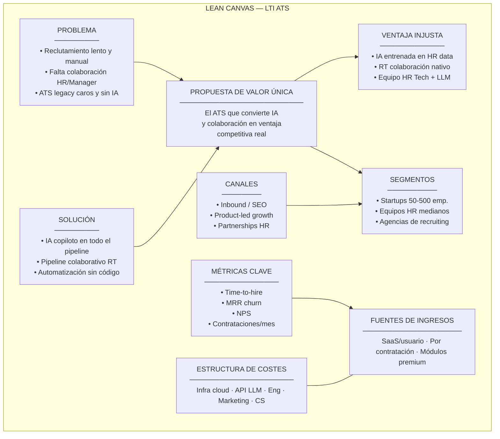
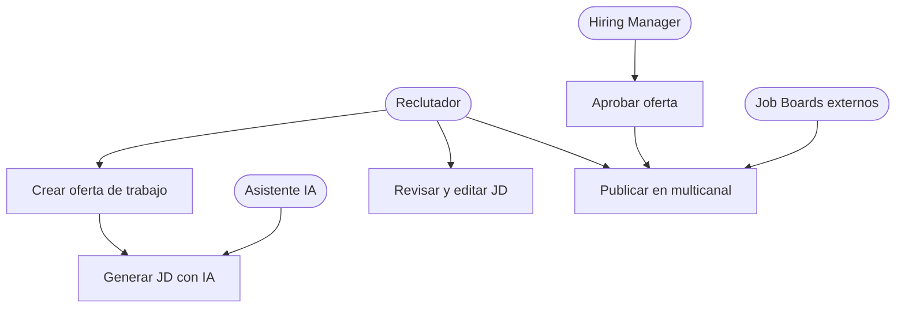
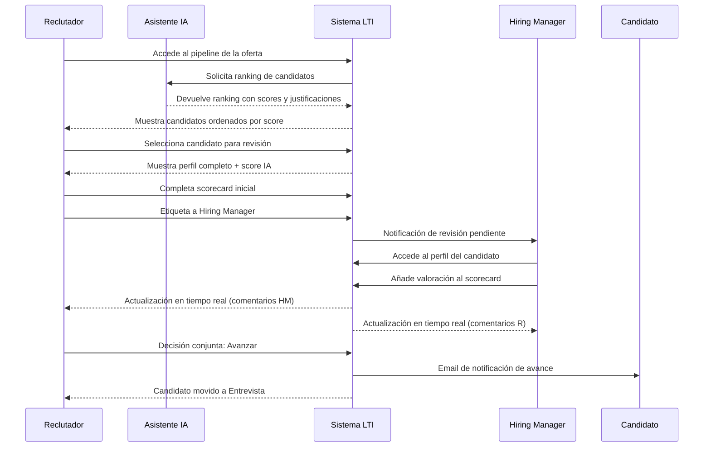
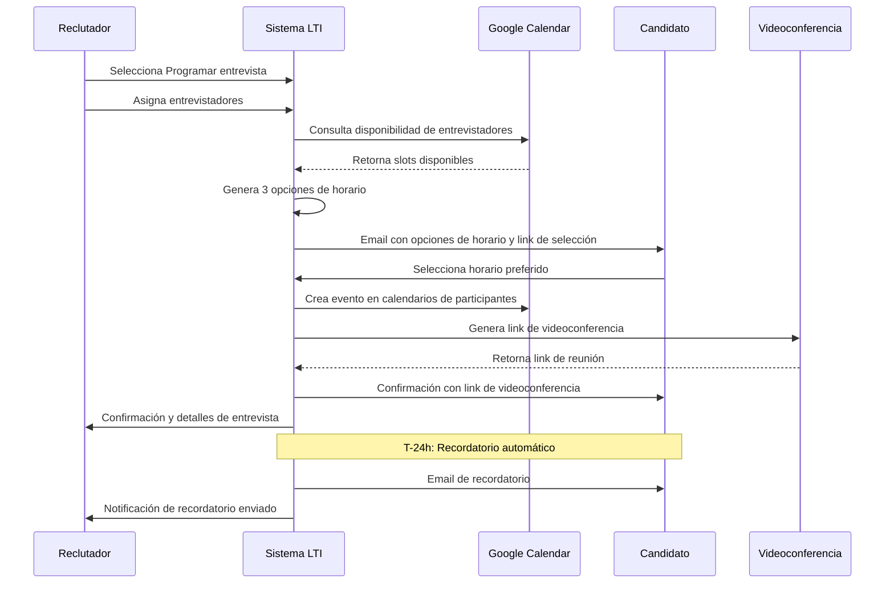
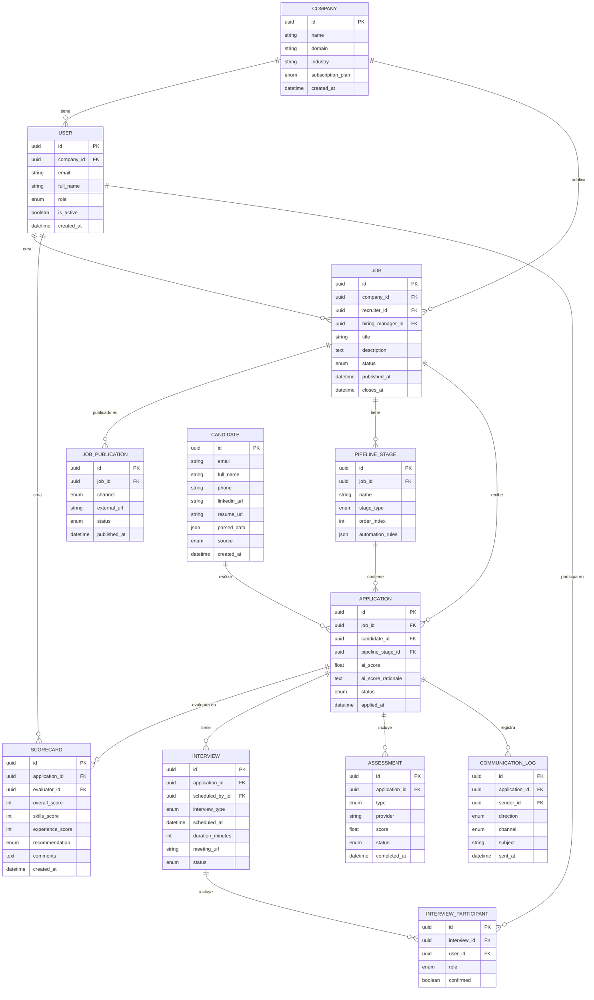
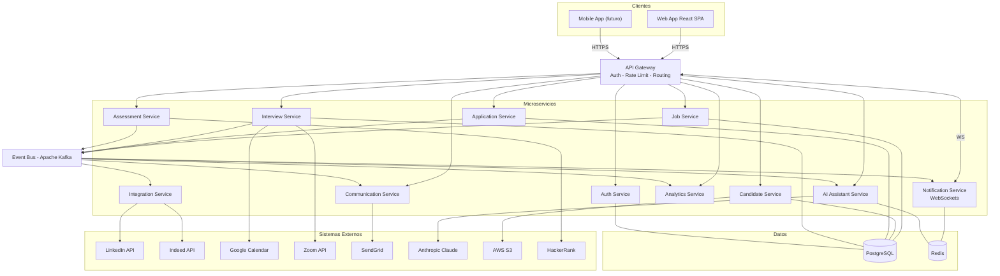
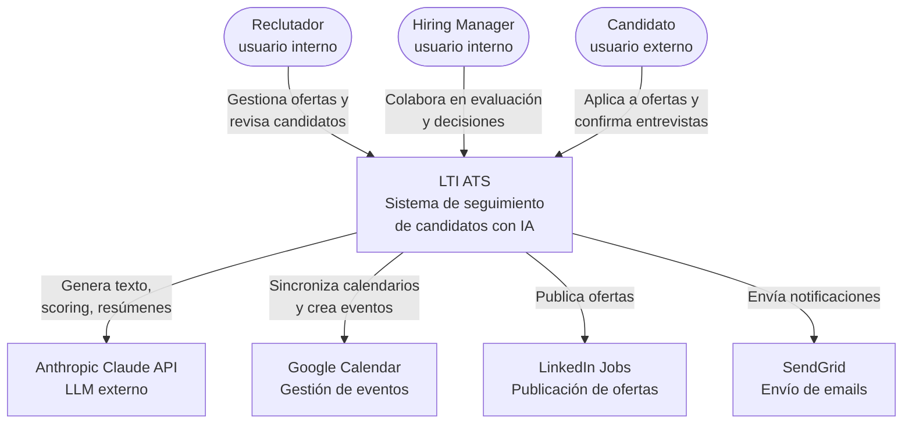
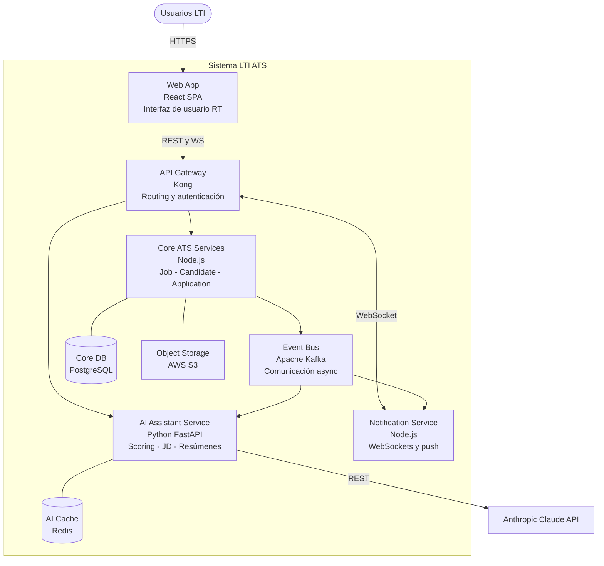
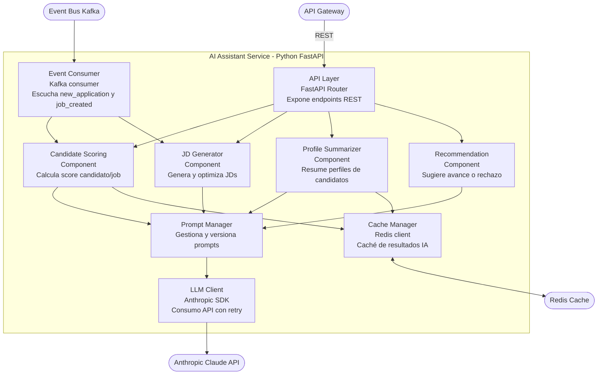
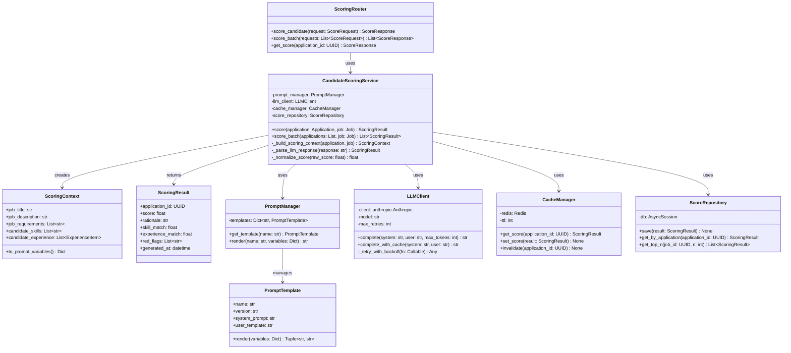

# LTI ATS — Diseño del Sistema

---

## 1. Descripción del Producto

### 1.1 Descripción breve

LTI es un **Applicant Tracking System (ATS) de nueva generación** diseñado para startups y empresas en crecimiento que necesitan reclutar talento con agilidad y precisión. A diferencia de los ATS tradicionales, LTI integra inteligencia artificial nativa en cada etapa del proceso: desde la redacción de ofertas hasta la selección final. Ofrece colaboración en tiempo real entre reclutadores y hiring managers, automatización de tareas repetitivas y un pipeline visual e intuitivo. LTI convierte el reclutamiento en una ventaja competitiva, reduciendo el tiempo de contratación hasta en un 60% y mejorando significativamente la calidad de los candidatos seleccionados.

---

### 1.2 Valor añadido y ventajas competitivas

#### Frente a la competencia

| Característica | Greenhouse | Lever | Workday | **LTI** |
|---|---|---|---|---|
| IA integrada nativa | Parcial | No | No | **Sí — en todo el pipeline** |
| Colaboración en tiempo real | Limitada | Básica | No | **Sí — comentarios, scoring colaborativo** |
| Automatización de flujos | Manual | Manual | Básica | **Sí — triggers configurables** |
| Asistente de redacción de JDs | No | No | No | **Sí — LLM integrado** |
| Scoring de candidatos por IA | No | No | No | **Sí — ranking automatizado** |
| Onboarding rápido (<1 día) | No | No | No | **Sí — plantillas preconfiguradas** |
| Precio accesible para startups | No | No | No | **Sí — pricing por uso** |

#### Ventajas competitivas clave

1. **IA copiloto en cada etapa**: El asistente de IA ayuda a redactar job descriptions, filtrar CVs, generar preguntas de entrevista y resumir feedback de evaluadores, reduciendo el trabajo manual del equipo de HR.

2. **Colaboración sincrónica**: Reclutadores y hiring managers trabajan sobre el mismo candidato en tiempo real: comentarios, puntuaciones, decisiones de avance y rechazo, todo con trazabilidad completa.

3. **Automatización de pipeline configurable**: Los equipos pueden definir triggers automáticos (ej. "si el score de IA > 80, enviar test técnico automáticamente") sin necesidad de código, mediante una interfaz visual de reglas.

4. **Time-to-hire acelerado**: Gracias a la combinación de IA, automatización y colaboración, el ciclo medio de contratación se reduce de semanas a días.

5. **Analítica predictiva**: Dashboards con métricas en tiempo real sobre el pipeline, funnel de conversión por etapa, fuentes de candidatos más efectivas y predicciones de aceptación de oferta.

6. **Integraciones nativas**: Conexión directa con LinkedIn, Indeed, Glassdoor, Google Calendar, Microsoft Teams y Slack sin configuración compleja.

---

### 1.3 Funciones principales

| # | Función | Descripción |
|---|---|---|
| 1 | **Gestión de ofertas de trabajo** | Creación, edición y publicación de job descriptions con asistencia de IA. Publicación multicanal (job boards, web propia, redes sociales) desde un único panel. |
| 2 | **Recepción y gestión de candidaturas** | Formulario de aplicación personalizable. Ingesta automática de CVs desde email y portales externos. Parser de CV con extracción de datos estructurados. |
| 3 | **Pipeline visual de candidatos** | Tablero Kanban con etapas configurables por proceso. Drag & drop de candidatos entre etapas. Vista de pipeline por oferta o por candidato. |
| 4 | **Scoring y filtrado por IA** | Ranking automático de candidatos basado en match con el job description. Detección de duplicados. Identificación de red flags en CVs. |
| 5 | **Colaboración en tiempo real** | Comentarios y valoraciones sobre candidatos visibles para todo el equipo. Sistema de scorecards configurables. Notificaciones push e in-app. |
| 6 | **Gestión de pruebas y assessments** | Envío automatizado de tests técnicos y psicométricos. Integración con plataformas de evaluación externas. Resultados centralizados en el perfil del candidato. |
| 7 | **Programación de entrevistas** | Sincronización con Google Calendar y Outlook. Propuesta automática de horarios según disponibilidad. Generación de links de videoconferencia. Recordatorios automáticos. |
| 8 | **Comunicación con candidatos** | Templates de email personalizables por etapa. Envío masivo o individual. Historial de comunicaciones en el perfil del candidato. |
| 9 | **Analítica e informes** | Dashboards de KPIs de reclutamiento: time-to-hire, cost-per-hire, conversion rates por etapa, fuentes de candidatos. Exportación a CSV/PDF. |
| 10 | **Asistente IA conversacional** | Chat interno para que reclutadores consulten al asistente: "¿Qué candidato tiene mejor perfil para este puesto?", "Redacta un email de rechazo para este candidato". |

---

### 1.4 Lean Canvas

#### Tabla Lean Canvas

| Bloque | Contenido |
|---|---|
| **1. Problema** | 1. Los procesos de reclutamiento son lentos, manuales y fragmentados entre herramientas. 2. Falta de colaboración estructurada entre reclutadores y hiring managers. 3. Los ATS existentes son caros, complejos y no usan IA de forma nativa. |
| **2. Segmentos de clientes** | Startups y scale-ups (50–500 empleados). Equipos de HR en empresas medianas sin presupuesto para Workday. Agencias de reclutamiento que gestionan múltiples clientes. |
| **3. Propuesta de valor única** | El único ATS que convierte la IA y la colaboración en tiempo real en una ventaja competitiva real para contratar mejor, más rápido y con menos esfuerzo. |
| **4. Solución** | ATS con IA copiloto integrada en cada etapa + pipeline visual colaborativo + automatización de flujos sin código. |
| **5. Canales** | Venta directa inbound (SEO, content marketing). Product-led growth (freemium). Partnerships con consultoras de HR. Integraciones en marketplaces (Slack App Directory, etc.). |
| **6. Estructura de costes** | Infraestructura cloud (AWS/GCP). Coste de API LLM (OpenAI / Anthropic). Equipo de ingeniería y producto. Ventas y marketing. Soporte y customer success. |
| **7. Fuentes de ingresos** | SaaS mensual por número de usuarios activos. Plan por número de contrataciones. Módulos premium (analítica avanzada, integraciones enterprise). |
| **8. Métricas clave** | Time-to-hire promedio de clientes. Tasa de retención mensual (MRR churn). NPS de reclutadores y hiring managers. Número de contrataciones procesadas/mes. Tasa de conversión pipeline (aplicación → contratación). |
| **9. Ventaja injusta** | Modelo de IA entrenado específicamente sobre datos de reclutamiento anonimizados. Experiencia de colaboración en tiempo real construida desde cero (no como add-on). Equipo fundador con experiencia en HR Tech y LLMs. |

#### Diagrama Lean Canvas

---

## 2. Casos de Uso Principales

### CU-01: Publicación de oferta de trabajo con asistencia de IA

**Descripción:** Un reclutador crea una nueva oferta de trabajo utilizando el asistente de IA para generar y optimizar el job description, y luego la publica en múltiples canales simultáneamente.

**Actores:**
- **Reclutador** (actor principal)
- **Hiring Manager** (actor secundario — aprueba la oferta)
- **Asistente IA** (sistema interno)
- **Job Boards externos** (LinkedIn, Indeed — sistemas externos)

**Flujo principal:**
1. El reclutador accede al módulo "Crear Oferta" en el dashboard de LTI.
2. Introduce el título del puesto, departamento y requisitos básicos.
3. Solicita al Asistente IA que genere un job description completo.
4. El Asistente IA genera el JD con descripción del puesto, responsabilidades, requisitos y beneficios.
5. El reclutador revisa y edita el JD generado.
6. El reclutador envía la oferta al Hiring Manager para su aprobación (notificación in-app y email).
7. El Hiring Manager revisa la oferta y la aprueba con un click.
8. El reclutador selecciona los canales de publicación (LinkedIn, Indeed, web corporativa).
9. LTI publica la oferta en todos los canales seleccionados de forma simultánea.
10. El sistema confirma la publicación y muestra las URLs generadas por cada canal.

**Flujos alternativos:**
- **4a.** El JD generado no satisface al reclutador: puede regenerarlo con instrucciones adicionales o editarlo manualmente.
- **7a.** El Hiring Manager solicita cambios: añade comentarios sobre la oferta; el reclutador ajusta y reenvía para aprobación.
- **9a.** Falla la publicación en un canal: el sistema notifica el error específico del canal y permite reintentar de forma independiente.

---

### CU-02: Revisión colaborativa de candidatos

**Descripción:** Un reclutador y un hiring manager evalúan conjuntamente los candidatos de una oferta activa, usando scorecards, comentarios en tiempo real y el ranking de IA para tomar decisiones de avance en el pipeline.

**Actores:**
- **Reclutador** (actor principal)
- **Hiring Manager** (actor colaborador)
- **Asistente IA** (sistema interno — genera ranking y resúmenes)
- **Candidato** (actor pasivo — su perfil es evaluado)

**Flujo principal:**
1. El reclutador accede al pipeline de la oferta y visualiza los candidatos en estado "Revisión".
2. El Asistente IA muestra el ranking de candidatos con score de compatibilidad (0–100) y justificación.
3. El reclutador selecciona un candidato para revisión detallada.
4. El sistema muestra el perfil completo: CV parseado, score IA, historial de comunicaciones.
5. El reclutador completa el scorecard de revisión inicial (habilidades, experiencia, cultura).
6. El reclutador etiqueta al Hiring Manager para que revise el candidato.
7. El Hiring Manager recibe notificación, accede al perfil y añade su valoración en el scorecard.
8. Reclutador y Hiring Manager ven los comentarios del otro en tiempo real.
9. Ambos toman la decisión conjunta: "Avanzar a entrevista" o "Descartar".
10. El sistema mueve el candidato a la etapa correspondiente y notifica al candidato por email.

**Flujos alternativos:**
- **5a.** El reclutador descarta directamente al candidato si el perfil no cumple requisitos mínimos.
- **7a.** El Hiring Manager no responde en 48h: el sistema envía recordatorio automático.
- **9a.** Reclutador y Hiring Manager no llegan a acuerdo: se escala a un tercer evaluador (HR Lead) usando el sistema de desempate.

---

### CU-03: Programación automatizada de entrevistas

**Descripción:** Una vez que un candidato es aprobado para entrevista, el sistema automatiza la propuesta de horarios, la confirmación y el envío de información, coordinando las agendas del entrevistador y el candidato.

**Actores:**
- **Reclutador** (actor iniciador)
- **Candidato** (actor externo — confirma horario)
- **Entrevistador** (actor interno — provee disponibilidad)
- **Google Calendar / Outlook** (sistema externo)
- **Sistema de videoconferencia** (Zoom / Meet — sistema externo)

**Flujo principal:**
1. El reclutador selecciona "Programar entrevista" desde el perfil del candidato.
2. El reclutador asigna uno o varios entrevistadores al proceso.
3. LTI consulta la disponibilidad de los entrevistadores vía Google Calendar API.
4. El sistema genera automáticamente 3 opciones de horario según disponibilidad combinada.
5. LTI envía al candidato un email con las 3 opciones y un link de selección.
6. El candidato selecciona su horario preferido en la landing page de LTI.
7. El sistema crea el evento en el calendario de todos los participantes.
8. LTI genera automáticamente el link de videoconferencia (Zoom/Meet).
9. El sistema envía confirmaciones con el link y la agenda a candidato y entrevistadores.
10. El día anterior a la entrevista, LTI envía recordatorios automáticos a todas las partes.

**Flujos alternativos:**
- **4a.** No hay horarios disponibles en los próximos 5 días: el sistema alerta al reclutador y amplía la búsqueda a 10 días.
- **6a.** El candidato no confirma en 48h: el sistema envía recordatorio automático. Si no responde en 72h, notifica al reclutador.
- **6b.** El candidato propone un horario alternativo: el reclutador recibe la solicitud y puede aprobar o proponer nuevas opciones.
- **7a.** Conflicto de calendario detectado: el sistema alerta al reclutador antes de confirmar y sugiere alternativas.

---

## 3. Modelo de Datos

### 3.1 Entidades y atributos

#### Company

| Atributo | Tipo | Descripción |
|---|---|---|
| id | UUID | Identificador único |
| name | String | Nombre de la empresa |
| domain | String | Dominio web corporativo |
| size | Enum | Tamaño (startup, sme, enterprise) |
| industry | String | Sector/industria |
| logo_url | String | URL del logo |
| created_at | DateTime | Fecha de creación |
| subscription_plan | Enum | Plan contratado (free, pro, enterprise) |

#### User

| Atributo | Tipo | Descripción |
|---|---|---|
| id | UUID | Identificador único |
| company_id | UUID | FK → Company |
| email | String | Email corporativo |
| full_name | String | Nombre completo |
| role | Enum | Rol (recruiter, hiring_manager, hr_admin, interviewer) |
| avatar_url | String | URL del avatar |
| calendar_token | String (enc.) | Token OAuth de calendario |
| is_active | Boolean | Estado activo/inactivo |
| created_at | DateTime | Fecha de alta |

#### Job

| Atributo | Tipo | Descripción |
|---|---|---|
| id | UUID | Identificador único |
| company_id | UUID | FK → Company |
| recruiter_id | UUID | FK → User |
| hiring_manager_id | UUID | FK → User |
| title | String | Título del puesto |
| description | Text | Job description completo |
| requirements | Text | Requisitos del puesto |
| department | String | Departamento |
| location | String | Ubicación |
| employment_type | Enum | Tipo (full_time, part_time, contract, internship) |
| salary_range_min | Integer | Salario mínimo |
| salary_range_max | Integer | Salario máximo |
| status | Enum | Estado (draft, pending_approval, published, closed, archived) |
| published_at | DateTime | Fecha de publicación |
| closes_at | DateTime | Fecha de cierre |
| created_at | DateTime | Fecha de creación |

#### JobPublication

| Atributo | Tipo | Descripción |
|---|---|---|
| id | UUID | Identificador único |
| job_id | UUID | FK → Job |
| channel | Enum | Canal (linkedin, indeed, glassdoor, company_website) |
| external_url | String | URL de la publicación |
| status | Enum | Estado (pending, published, failed) |
| published_at | DateTime | Fecha efectiva de publicación |

#### Candidate

| Atributo | Tipo | Descripción |
|---|---|---|
| id | UUID | Identificador único |
| email | String | Email del candidato |
| full_name | String | Nombre completo |
| phone | String | Teléfono |
| linkedin_url | String | Perfil de LinkedIn |
| location | String | Ubicación |
| resume_url | String | URL del CV almacenado |
| parsed_data | JSON | Datos extraídos del CV |
| source | Enum | Origen (linkedin, indeed, referral, direct) |
| created_at | DateTime | Fecha de primer registro |

#### Application

| Atributo | Tipo | Descripción |
|---|---|---|
| id | UUID | Identificador único |
| job_id | UUID | FK → Job |
| candidate_id | UUID | FK → Candidate |
| pipeline_stage_id | UUID | FK → PipelineStage |
| ai_score | Float | Score de compatibilidad IA (0–100) |
| ai_score_rationale | Text | Justificación del score |
| status | Enum | Estado (active, hired, rejected, withdrawn) |
| applied_at | DateTime | Fecha de aplicación |
| updated_at | DateTime | Última actualización |

#### PipelineStage

| Atributo | Tipo | Descripción |
|---|---|---|
| id | UUID | Identificador único |
| job_id | UUID | FK → Job |
| name | String | Nombre de la etapa |
| stage_type | Enum | Tipo (applied, review, assessment, interview, offer, hired, rejected) |
| order_index | Integer | Posición en el pipeline |
| automation_rules | JSON | Reglas de automatización configuradas |

#### Scorecard

| Atributo | Tipo | Descripción |
|---|---|---|
| id | UUID | Identificador único |
| application_id | UUID | FK → Application |
| evaluator_id | UUID | FK → User |
| overall_score | Integer | Puntuación global (1–5) |
| skills_score | Integer | Puntuación técnica (1–5) |
| experience_score | Integer | Puntuación de experiencia (1–5) |
| culture_score | Integer | Puntuación de fit cultural (1–5) |
| comments | Text | Comentarios del evaluador |
| recommendation | Enum | Recomendación (advance, reject, hold) |
| created_at | DateTime | Fecha de evaluación |

#### Interview

| Atributo | Tipo | Descripción |
|---|---|---|
| id | UUID | Identificador único |
| application_id | UUID | FK → Application |
| scheduled_by_id | UUID | FK → User |
| interview_type | Enum | Tipo (screening, technical, cultural, final) |
| scheduled_at | DateTime | Fecha y hora programada |
| duration_minutes | Integer | Duración en minutos |
| meeting_url | String | Link de videoconferencia |
| calendar_event_id | String | ID del evento en Google Calendar |
| status | Enum | Estado (scheduled, completed, cancelled, no_show) |
| notes | Text | Notas post-entrevista |

#### InterviewParticipant

| Atributo | Tipo | Descripción |
|---|---|---|
| id | UUID | Identificador único |
| interview_id | UUID | FK → Interview |
| user_id | UUID | FK → User |
| role | Enum | Rol (interviewer, observer) |
| confirmed | Boolean | Confirmación de asistencia |

#### Assessment

| Atributo | Tipo | Descripción |
|---|---|---|
| id | UUID | Identificador único |
| application_id | UUID | FK → Application |
| type | Enum | Tipo (technical, psychometric, language) |
| provider | String | Proveedor externo |
| external_id | String | ID en plataforma externa |
| sent_at | DateTime | Fecha de envío |
| completed_at | DateTime | Fecha de finalización |
| score | Float | Puntuación obtenida |
| result_url | String | URL del informe |
| status | Enum | Estado (pending, sent, completed, expired) |

#### CommunicationLog

| Atributo | Tipo | Descripción |
|---|---|---|
| id | UUID | Identificador único |
| application_id | UUID | FK → Application |
| sender_id | UUID | FK → User (null si automático) |
| direction | Enum | Dirección (outbound, inbound) |
| channel | Enum | Canal (email, in_app, sms) |
| subject | String | Asunto del mensaje |
| body | Text | Cuerpo del mensaje |
| sent_at | DateTime | Fecha de envío |
| opened_at | DateTime | Fecha de apertura |

---

### 3.2 Relaciones

| Entidad A | Relación | Entidad B | Cardinalidad |
|---|---|---|---|
| Company | tiene | User | 1:N |
| Company | tiene | Job | 1:N |
| User | crea | Job | N:1 (recruiter) |
| User | aprueba | Job | N:1 (hiring_manager) |
| Job | tiene | JobPublication | 1:N |
| Job | tiene | PipelineStage | 1:N |
| Job | recibe | Application | 1:N |
| Candidate | realiza | Application | 1:N |
| Application | está en | PipelineStage | N:1 |
| Application | tiene | Scorecard | 1:N |
| Application | tiene | Interview | 1:N |
| Application | tiene | Assessment | 1:N |
| Application | tiene | CommunicationLog | 1:N |
| Interview | tiene | InterviewParticipant | 1:N |
| User | participa en | InterviewParticipant | 1:N |
| User | crea | Scorecard | 1:N |

---

### 3.3 Diagrama Entidad-Relación

---

## 4. Diseño del Sistema a Alto Nivel

### 4.1 Arquitectura elegida

**Arquitectura:** Microservicios orientados a dominio con comunicación asíncrona vía eventos.

**Justificación:**
- **Escalabilidad independiente**: El módulo de IA puede escalar horizontalmente sin afectar al pipeline de candidatos.
- **Resiliencia**: Un fallo en el servicio de integraciones externas no afecta al pipeline interno.
- **Equipos autónomos**: Cada servicio puede ser desarrollado y desplegado de forma independiente.
- **Colaboración en tiempo real**: El servicio de notificaciones con WebSockets puede escalar de forma dedicada.
- **Event-driven**: Los cambios de estado en el pipeline disparan automáticamente notificaciones, automations y comunicaciones vía eventos de dominio.

**Stack tecnológico:**
- **Frontend**: React + TypeScript (SPA con WebSockets para RT)
- **API Gateway**: Kong / AWS API Gateway
- **Backend**: Node.js / Python (según servicio)
- **Message broker**: Apache Kafka
- **Base de datos**: PostgreSQL (relacional) + Redis (caché y WebSockets)
- **IA/LLM**: API Anthropic Claude
- **Storage**: AWS S3
- **Infraestructura**: AWS EKS (Kubernetes)

---

### 4.2 Componentes principales

| Servicio | Responsabilidad |
|---|---|
| **Web App (Frontend)** | SPA React con pipeline visual, formularios, dashboards y colaboración RT |
| **API Gateway** | Punto de entrada único: autenticación JWT, rate limiting, routing |
| **Auth Service** | Gestión de identidad, OAuth2, RBAC |
| **Job Service** | CRUD de ofertas, ciclo de aprobación, publicación multicanal |
| **Candidate Service** | Gestión de candidatos, parsing de CVs, deduplicación |
| **Application Service** | Pipeline de candidaturas, gestión de etapas, scorecards |
| **AI Assistant Service** | Scoring, generación de JDs, resúmenes, recomendaciones |
| **Interview Service** | Programación de entrevistas, integración con calendarios |
| **Assessment Service** | Envío y recepción de pruebas con proveedores externos |
| **Communication Service** | Templates de email, envío de notificaciones, historial |
| **Integration Service** | Conectores con LinkedIn, Indeed, Google Calendar, Zoom |
| **Notification Service** | WebSockets para colaboración RT, notificaciones push |
| **Analytics Service** | Métricas, dashboards y reportes |
| **Event Bus (Kafka)** | Mensajería asíncrona entre servicios |

---

### 4.3 Integraciones externas

| Sistema externo | Tipo | Propósito |
|---|---|---|
| LinkedIn Jobs API | REST OAuth2 | Publicación de ofertas y sincronización de aplicaciones |
| Indeed Publisher API | REST | Publicación de ofertas |
| Glassdoor API | REST | Publicación de ofertas |
| Google Calendar API | REST OAuth2 | Disponibilidad y creación de eventos |
| Microsoft Graph API | REST OAuth2 | Alternativa a Google Calendar |
| Zoom API | REST OAuth2 | Links de videoconferencia |
| Google Meet | REST | Alternativa a Zoom |
| SendGrid / Amazon SES | REST | Emails transaccionales |
| HackerRank / TestGorilla | REST + Webhook | Envío y recepción de assessments |
| Anthropic Claude API | REST | LLM copiloto de IA |
| AWS S3 | SDK | Almacenamiento de CVs y documentos |
| Slack / Microsoft Teams | Webhooks | Notificaciones de equipo |

---

### 4.4 Diagrama de arquitectura de alto nivel

---

## 5. Diagrama C4 — AI Assistant Service

**Componente seleccionado:** AI Assistant Service

El **AI Assistant Service** centraliza toda la lógica de inteligencia artificial de LTI: scoring de candidatos, generación de job descriptions, resúmenes de perfiles y recomendaciones de avance. Es el componente más diferenciador de la plataforma y suficientemente acotado para ilustrar los 4 niveles del modelo C4.

---

### Nivel 1: System Context

Visión del sistema LTI en su entorno con usuarios y sistemas externos.

---

### Nivel 2: Container

Contenedores del sistema LTI con el AI Assistant Service en contexto.

---

### Nivel 3: Component

Componentes internos del AI Assistant Service.

---

### Nivel 4: Code

Detalle de clases del **Candidate Scoring Component**.

---

*Documento generado para LTI ATS — Diseño del Sistema v1.0*
*Fecha: 2026-04-14*
